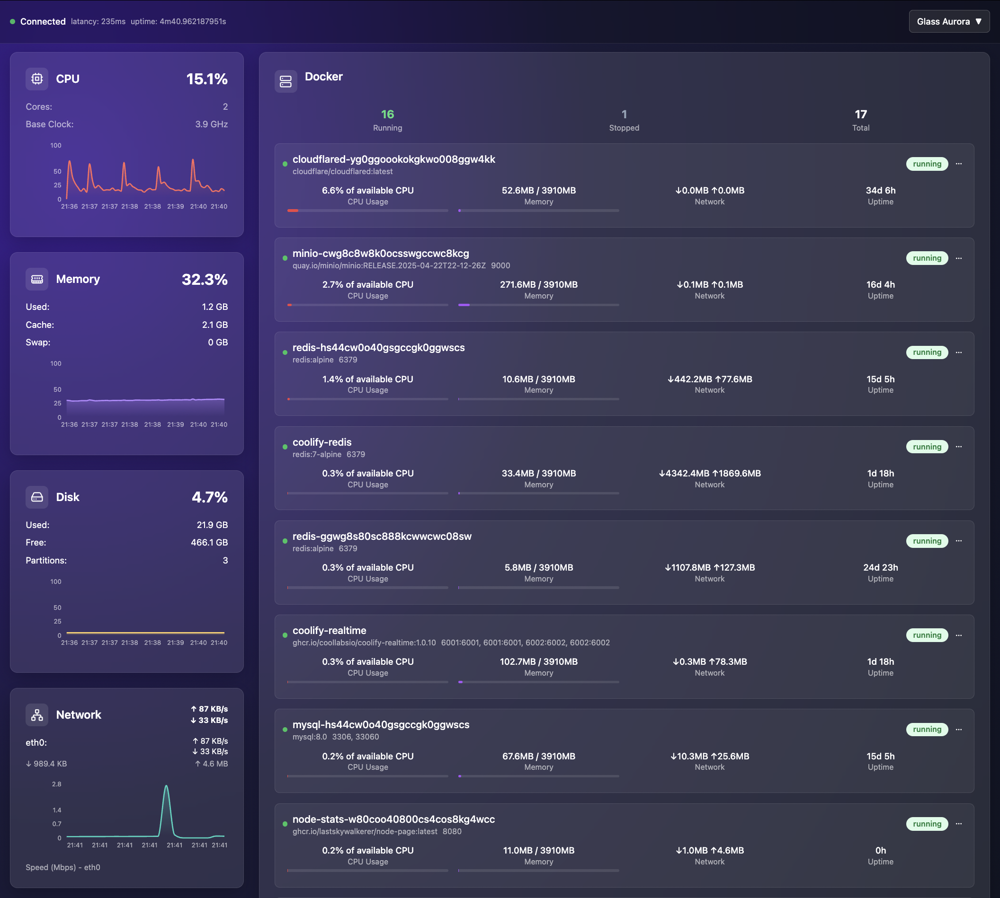
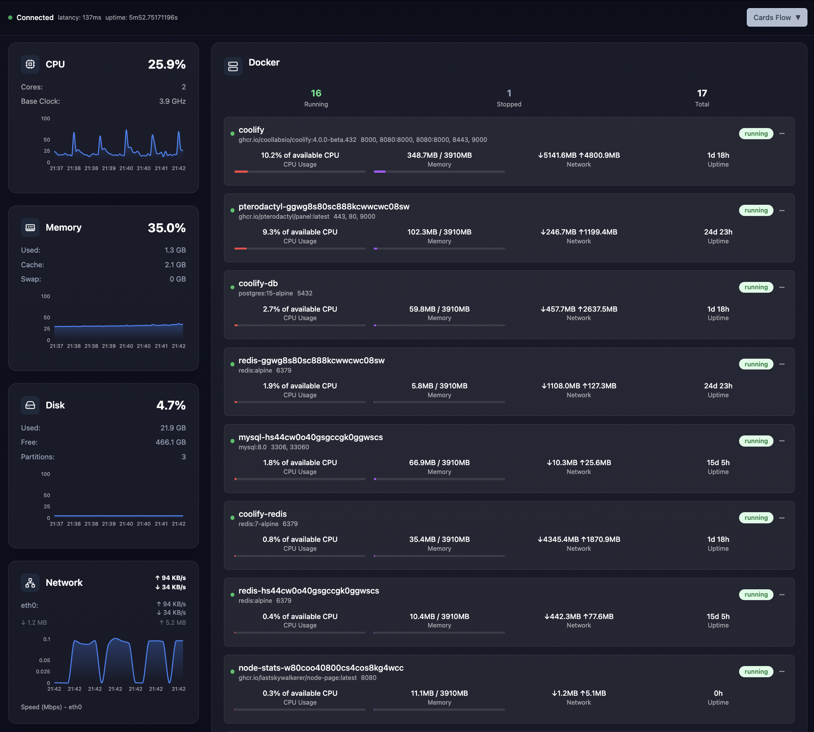

# Node Stats

**Node Stats** is an open-source, self-hosted system monitoring and infrastructure monitoring dashboard built with Go and React. Monitor your servers, Docker containers, and system resources in real-time with a beautiful, modern web interface. Perfect for DevOps engineers, system administrators, and developers who need comprehensive server monitoring, container monitoring, and infrastructure metrics visualization.

## What is Node Stats?

Node Stats is a lightweight, self-hosted alternative to commercial monitoring solutions like Grafana, Prometheus, or Datadog. It provides real-time system metrics collection, Docker container monitoring, and a beautiful dashboard interface without the complexity of enterprise monitoring tools. Built with Go for performance and React for a modern user experience, Node Stats is ideal for monitoring single servers, development environments, or small infrastructure deployments.

### Key Capabilities

- **Server Monitoring**: Real-time CPU, memory, disk, and network metrics
- **Docker Monitoring**: Container statistics, resource usage, and health monitoring
- **System Metrics**: Temperature sensors, system information, and hardware monitoring
- **Self-Hosted**: Complete control over your data with no external dependencies
- **Lightweight**: Minimal resource footprint compared to enterprise monitoring solutions
- **Modern UI**: Beautiful, customizable dashboard themes with real-time updates

## Features

- **Real-time Monitoring**: Live CPU usage, memory usage, disk I/O, network traffic, and Docker container metrics
- **Beautiful UI**: Modern monitoring dashboard with multiple customizable themes (Neon Terminal, Glass Aurora, Cards Flow, Slate Pro)
- **RESTful API**: Clean REST API endpoints for all system metrics and Docker statistics
- **Docker Support**: Comprehensive Docker container monitoring with resource usage tracking
- **Persistent Storage**: SQLite database for historical metrics and data retention
- **User Authentication**: Secure login system with JWT tokens and refresh tokens
- **Temperature Monitoring**: Hardware temperature sensor monitoring for system health
- **Multi-theme Support**: Switch between different dashboard themes for personalized monitoring experience

## Use Cases

Node Stats is perfect for:

- **Development Teams**: Monitor development servers and staging environments
- **DevOps Engineers**: Track infrastructure health and resource utilization
- **System Administrators**: Monitor server performance and system metrics
- **Docker Users**: Monitor containerized applications and Docker host resources
- **Home Lab Enthusiasts**: Self-hosted monitoring for personal servers and homelabs
- **Small to Medium Infrastructure**: Lightweight monitoring solution without enterprise complexity
- **Privacy-Conscious Users**: Self-hosted alternative to cloud-based monitoring services

## Roadmap

- ✅ Real-time metrics monitoring (CPU, memory, disk, network, Docker containers, temperature sensors)
- ✅ Modern UI dashboard with multiple themes (Neon Terminal, Glass Aurora, Cards Flow, Slate Pro)
- ✅ RESTful API endpoints for all metrics
- ✅ User authentication (registration, login, refresh tokens, user management)
- ✅ SQLite database for historical metrics storage
- ❌ Application configuration via UI on first launch (setup wizard for initial configuration)
- ❌ Multi-node statistics synchronization and aggregation (push-based model where each node sends metrics to a central server, eliminating the need to expose individual nodes to the internet for secure centralized collection)
- ❌ Alert system (configurable notifications when metric thresholds are exceeded)
- ❌ Container logs monitoring (real-time viewing and filtering of Docker container logs)
- ❌ Application port tunneling (tunnel selected application ports from closed machines through the central node to local machine for fast, direct, and secure access)
- ❌ Additional time-series databases support (integration with databases better suited for time-series data like InfluxDB, TimescaleDB)

## Screenshots

### Neon Terminal Theme


### Glass Aurora Theme



### Cards Flow Theme



### Slate Pro Theme


## Installation & Quick Start

Get Node Stats up and running in minutes. Choose between Docker deployment (recommended for production) or local development setup.

### Using Docker (Recommended)

The easiest way to deploy Node Stats is using Docker Compose. This method provides automatic container management and easy configuration.

```yaml
services:
  node-stats:
    image: 'ghcr.io/lastskywalkerer/node-page:latest'
    # ports:
    #   - "8080:8080"
    # Optional: host network mode to access host interface metrics
    network_mode: host
    volumes:
      # Mount database file for persistence
      - ./stats.db:/app/stats.db
      # Mount Docker socket for Docker metrics
      - /var/run/docker.sock:/var/run/docker.sock:ro
      # Mount host filesystem for system metrics
      - /:/host:ro
    pid: host
    ipc: host
    restart: unless-stopped
    environment:
      - ADDR=${ADDR:-:8080}
      - GIN_MODE=release
      - HOST_PROC=/host/proc
      - HOST_SYS=/host/sys
      - HOST_ETC=/host/etc
      - JWT_SECRET=${JWT_SECRET:-your-jwt-secret-key-change-in-production}
      - REFRESH_SECRET=${REFRESH_SECRET:-your-refresh-secret-key-change-in-production}
```

Then run:

```bash
docker-compose up -d
```

The application will be available at `http://localhost:8080` by default. You can change the port by setting the `ADDR` environment variable (e.g., `ADDR=:9090`).

### Local Development

#### Backend (Go)

```bash
# Install dependencies
go mod download

# Set required environment variables
export JWT_SECRET=your-jwt-secret-key
export REFRESH_SECRET=your-refresh-secret-key

# Optional: customize server address (default: :8080)
export ADDR=:8080

# Run the server
go run cmd/server/main.go
```

#### Frontend (React + TypeScript)

```bash
cd frontend
yarn install
yarn dev
```

The frontend development server typically runs on `http://localhost:5173` (Vite default port).

## API Documentation

Node Stats provides a comprehensive REST API for accessing all system metrics programmatically. All endpoints return JSON data and support real-time metrics retrieval.

### System Metrics Endpoints

- `GET /api/cpu` - CPU usage metrics including per-core statistics and load averages
- `GET /api/memory` - Memory usage metrics including RAM, swap, and memory statistics
- `GET /api/disk` - Disk usage metrics including I/O statistics and filesystem information
- `GET /api/network` - Network statistics including interface traffic and connection data
- `GET /api/docker` - Docker containers information including resource usage and container status
- `GET /api/system` - System information including hostname, uptime, and platform details
- `GET /api/sensors` - Hardware temperature sensors and thermal monitoring data

### Authentication Endpoints

- `POST /api/auth/register` - User registration
- `POST /api/auth/login` - User authentication
- `POST /api/auth/refresh` - Refresh access token
- `POST /api/auth/logout` - User logout

All API endpoints support CORS and can be integrated with external monitoring tools, automation scripts, or other applications.

### Pulling Pre-built Images

```bash
# Pull from GitHub Container Registry
docker pull ghcr.io/lastskywalkerer/node-page:latest

# Run the container (default port 8080)
docker run -p 8080:8080 \
  -e ADDR=:8080 \
  -e JWT_SECRET=your-jwt-secret-key \
  -e REFRESH_SECRET=your-refresh-secret-key \
  -v ./stats.db:/app/stats.db \
  ghcr.io/lastskywalkerer/node-page:latest
```

### Configuration

Node Stats is configured via environment variables:

- `ADDR` - Server address and port (default: `:8080`)
- `GIN_MODE` - Gin framework mode: `release` or `debug` (default: `release`)
- `JWT_SECRET` - Secret key for JWT access tokens (required)
- `REFRESH_SECRET` - Secret key for JWT refresh tokens (required)
- `DB_TYPE` - Database type (default: `sqlite`)
- `DB_DSN` - Database connection string or file path (default: `stats.db`)
- `DEBUG` - Enable debug mode: `true` or `false` (default: `false`)

## Architecture & Technology Stack

Node Stats is built using modern web technologies and follows Clean Architecture principles for maintainability and scalability.

### Technology Stack

- **Frontend**: React 18 + TypeScript + Tailwind CSS for a modern, responsive user interface
- **Backend**: Go (Golang) with Gin web framework for high-performance API server
- **Database**: SQLite with GORM ORM for lightweight, file-based data storage
- **Monitoring**: Real-time system metrics collection using native Go libraries
- **Authentication**: JWT-based authentication with refresh token support
- **Containerization**: Docker and Docker Compose for easy deployment

### Architecture Principles

- **Clean Architecture**: Separation of concerns with domain, application, infrastructure, and presentation layers
- **RESTful API Design**: Standard REST endpoints for all system metrics
- **Real-time Updates**: WebSocket or polling-based real-time metric updates
- **Modular Design**: Feature-based module structure for easy extensibility

## Development

### Project Structure

```
├── cmd/server/          # Application entry point
├── internal/
│   ├── app/            # Application configuration
│   └── modules/        # Feature modules (CPU, Memory, etc.)
├── frontend/           # React frontend
├── .github/workflows/  # CI/CD pipelines
└── Dockerfile         # Container definition
```

## Development

### Building from Source

```bash
# Clone the repository
git clone https://github.com/yourusername/node-stats.git
cd node-stats

# Build backend
go build -o bin/server cmd/server/main.go

# Build frontend
cd frontend
yarn install
yarn build
```

### Running Tests

```bash
# Backend tests
go test ./...

# Frontend tests
cd frontend
yarn test
```

## Contributing

Contributions are welcome! Whether it's bug fixes, new features, or documentation improvements, your help makes Node Stats better.

1. Fork the repository
2. Create a feature branch (`git checkout -b feature/amazing-feature`)
3. Make your changes
4. Test thoroughly
5. Commit your changes (`git commit -m 'Add some amazing feature'`)
6. Push to the branch (`git push origin feature/amazing-feature`)
7. Open a Pull Request

## Related Projects & Alternatives

Node Stats is inspired by and can be used alongside:
- **Grafana** - Advanced visualization and alerting (Node Stats is lighter)
- **Prometheus** - Time-series database and monitoring (Node Stats uses SQLite)
- **Netdata** - Real-time performance monitoring (Node Stats focuses on simplicity)
- **Portainer** - Docker management UI (Node Stats adds system monitoring)

## Keywords & Tags

**Monitoring Tools**: system monitoring, server monitoring, infrastructure monitoring, docker monitoring, container monitoring, system metrics, server metrics, real-time monitoring, self-hosted monitoring

**Technologies**: Go, Golang, React, TypeScript, Docker, SQLite, REST API, JWT authentication, Gin framework, Tailwind CSS

**Use Cases**: DevOps monitoring, server health monitoring, Docker container stats, system performance tracking, homelab monitoring, development server monitoring, infrastructure health checks

**Features**: CPU monitoring, memory monitoring, disk monitoring, network monitoring, temperature sensors, Docker stats, system information, real-time dashboard, monitoring dashboard

## License

MIT License - see LICENSE file for details
