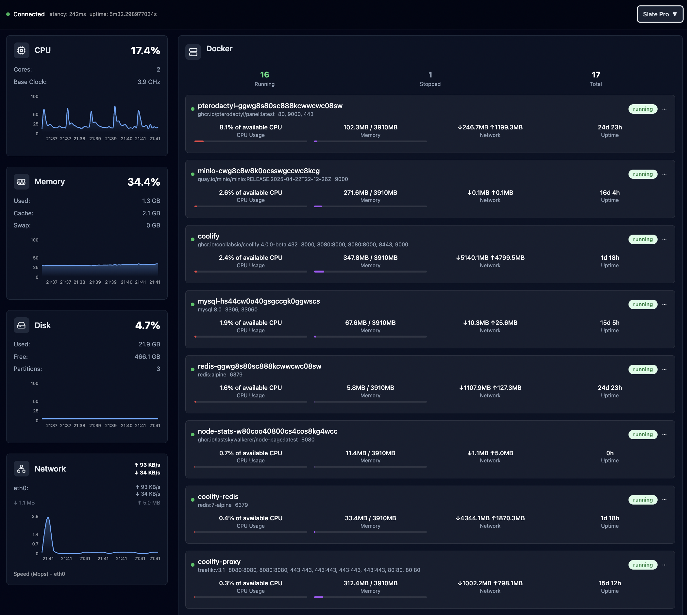

# Node Stats

A comprehensive system monitoring dashboard for Node.js applications with real-time metrics visualization.

## Features

- **Real-time Monitoring**: Live CPU, memory, disk, network, and Docker container metrics
- **Beautiful UI**: Modern dashboard with multiple themes (Neon Terminal, Glass Aurora, Cards Flow, etc.)
- **RESTful API**: Clean API endpoints for all metrics
- **Docker Support**: Monitor Docker containers and system resources
- **Persistent Storage**: SQLite database for historical metrics

## Screenshots

### Neon Terminal Theme


### Glass Aurora Theme


### Cards Flow Theme


### Slate Pro Theme


## Quick Start

### Using Docker (Recommended)

Create a `docker-compose.yml` file:

```yaml
services:
  node-stats:
    image: 'ghcr.io/lastskywalkerer/node-page:latest'
    volumes:
      - '/var/run/docker.sock:/var/run/docker.sock:ro'
    pid: host
    ipc: host
    restart: unless-stopped
    environment:
      - GIN_MODE=release
```

Then run:

```bash
docker-compose up -d
```

The application will be available at `http://localhost:8080`

### Local Development

#### Backend (Go)
```bash
go mod download
go run cmd/server/main.go
```

#### Frontend (React + TypeScript)
```bash
cd frontend
yarn install
yarn dev
```

## API Endpoints

- `GET /api/cpu` - CPU usage metrics
- `GET /api/memory` - Memory usage metrics
- `GET /api/disk` - Disk usage metrics
- `GET /api/network` - Network statistics
- `GET /api/docker` - Docker containers info
- `GET /api/system` - System information


### Pulling Pre-built Images

```bash
# Pull from GitHub Container Registry
docker pull ghcr.io/lastskywalkerer/node-page:latest

# Run the container
docker run -p 8080:8080 ghcr.io/lastskywalkerer/node-page:latest
```

## Architecture

The application follows Clean Architecture principles:

- **Frontend**: React + TypeScript + Tailwind CSS
- **Backend**: Go with Gin framework
- **Database**: SQLite with GORM
- **Monitoring**: Real-time system metrics collection

## Development

### Project Structure

```
├── cmd/server/          # Application entry point
├── internal/
│   ├── app/            # Application configuration
│   └── modules/        # Feature modules (CPU, Memory, etc.)
├── frontend/           # React frontend
├── .github/workflows/  # CI/CD pipelines
└── Dockerfile         # Container definition
```


## Contributing

1. Fork the repository
2. Create a feature branch
3. Make your changes
4. Test thoroughly
5. Submit a pull request

## License

MIT License
