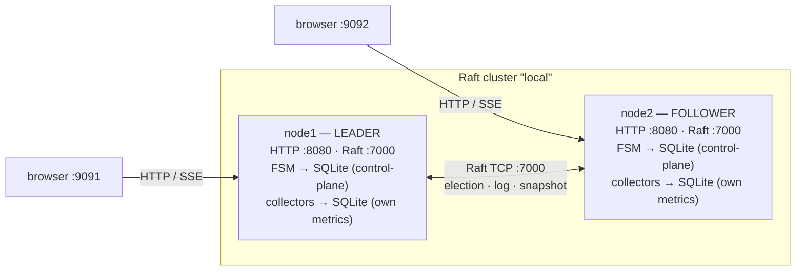
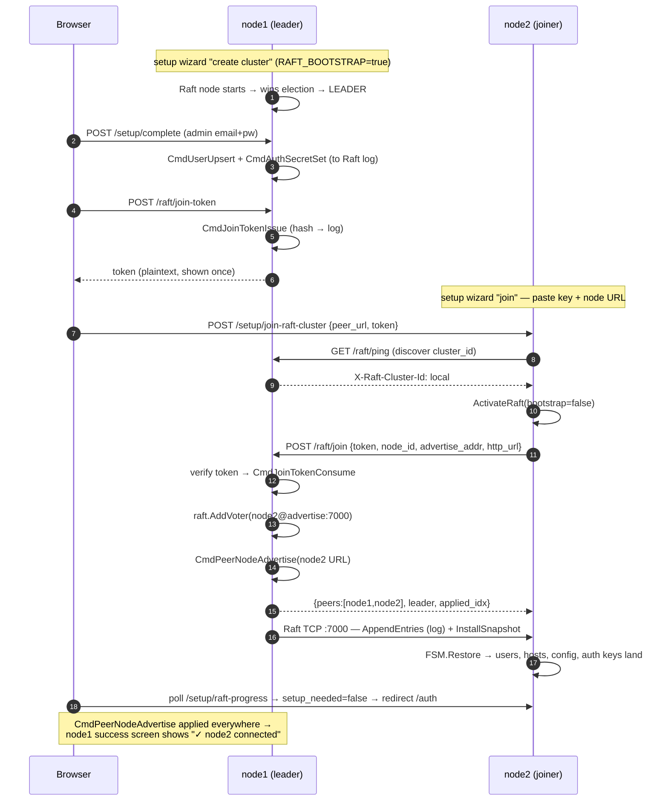
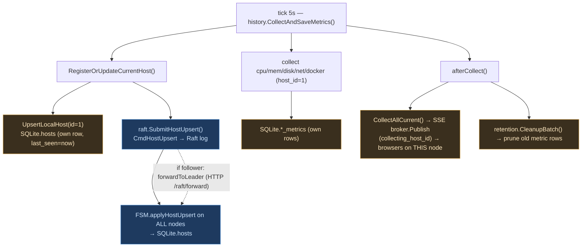
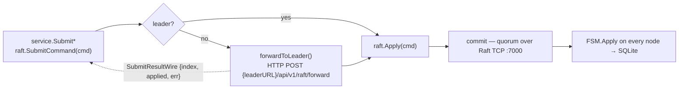

# Cluster architecture (Raft)

How node-stats forms a cluster, what each node talks over which channel, what data flows
at which moment, where it is stored, and how the client sees it.

**One-line model:** Raft replicates the **control-plane** (host registry, users, sessions,
auth keys, config, peer catalog, join tokens) so every node converges on identical state.
**Metrics time-series are collected and stored locally per node** — they are not streamed
over the Raft log (only included in snapshots as a join baseline).

---

## 1. Channels & ports

| Channel | Protocol | Who ↔ who | Carries |
|---|---|---|---|
| **Raft transport** `:7000` (`RAFT_BIND_ADDR`) | TCP (hashicorp/raft) | node ↔ node | leader election, `AppendEntries` (log replication), `InstallSnapshot` |
| **HTTP control** `:8080` | REST | joiner → leader | `GET /raft/ping`, `POST /raft/join`, `POST /raft/forward` |
| **HTTP app** `:8080` | REST | browser → node | `/cpu /memory /disk /network /docker`, `/hosts`, `/auth/*`, `/setup/*`, `/raft/status` |
| **SSE** `:8080/stream` | text/event-stream | browser → node | this node's live metric snapshots (`collecting_host_id`) |

In Docker the app port is published as `:9091` (node1) / `:9092` (node2); nodes reach each
other by Compose service name (`node1:7000`, `http://node1:8080`).

---

## 2. Topology



Each node owns its **own** SQLite file. Raft keeps the control-plane part identical across
nodes; the metric tables stay per-node.

---

## 3. Cluster formation (join)



**Stored where:** join token → `cluster_join_tokens` (hash, all nodes); admin → `users`
(all); auth keys → `cluster_config` (all — so a token minted on node1 is valid on node2);
node URL → `peer_node_advertise` (all — needed for write-forwarding).

---

## 4. Steady state — collection cycle (~every 5 s, on every node)



🔵 replicated cluster-wide (via log)  🟠 local to the node. Net effect: the **host registry
and `last_seen` converge**; **metrics stay per-node**.

---

## 5. Write path through consensus (any control-plane mutation)



Commands that travel this path: `CmdHostUpsert/Delete`, `CmdUserUpsert/Delete`,
`CmdRefreshTokenIssue/Revoke`, `CmdAuthSecretSet`, `CmdConfigSet`,
`CmdPeerNodeAdvertise/Remove`, `CmdJoinTokenIssue/Consume`.

> The follower→leader forward serialises the result as `SubmitResultWire` (error as a string)
> because `error` is an interface and can't round-trip through JSON.

---

## 6. Storage map

```
  data/raft/  (BoltDB)                       stats.db  (SQLite, per node)
  ────────────────────                       ─────────────────────────────────────────────
  • raft log     (commands)   ◄── consensus   REPLICATED (FSM applier + in snapshot):
  • stable store (term/vote)                    hosts · users · refresh_tokens · cluster_config
  • snapshots    (point-in-time) ──► on join    peer_node_advertise · cluster_join_tokens

                                              LOCAL (written by collectors; included in
                                              snapshots as a baseline, NOT live-replicated):
                                                cpu_metrics · memory_metrics · disk_metrics
                                                network_metrics · docker_metrics · docker_containers
```

The FSM applies commands into the **same** SQLite the node serves reads from, so replicated
tables stay identical. Metric tables in that DB are written directly by the collectors and
diverge per node. (`internal/cluster/raft/snapshot_sqlite.go` lists the snapshot-managed
tables; there is no `CmdMetricBatch` applier, so metrics never flow through the live log.)

---

## 7. How the client sees it

```mermaid
sequenceDiagram
  autonumber
  participant Br as Browser
  participant N as node
  Note over Br: open /machines/:id/stats
  Br->>N: GET /cpu|memory|disk|network|docker?host_id=&hours=  (once)
  N-->>Br: latest + history (from THIS node's local SQLite)
  Br->>N: GET /stream?host_id=  (SSE subscribe)
  loop every collection tick
    N-->>Br: snapshot {..., collecting_host_id}
    Note over Br: useLiveMetricsQuerySync merges into the same<br/>React Query keys → widgets update, no polling
  end
  Note over Br: open /machines — GET /hosts (replicated registry) → all cluster nodes;<br/>GET /health?host_id= → online/offline by last_seen (45s threshold)
```

**Practical consequence:** the machine list shows **all** cluster nodes (registry is
replicated), but a node serves live metrics/graphs for **itself** — a remote peer has no live
stream on another node (its metrics are collected and live on it). So each node is best viewed
on its own UI.

---

## 8. What / when / where / how shown

| Data | When | Channel | Stored | Client sees |
|---|---|---|---|---|
| Host registry (`last_seen`, name, MAC) | every 5 s | Raft log `CmdHostUpsert` | `hosts` (all nodes) | `/machines` list, online/offline |
| Metrics CPU/mem/disk/net/docker | every 5 s | local write + SSE | `*_metrics` (own node only) | charts (REST) + live (SSE) on its node |
| Users / roles | on change | Raft log `CmdUserUpsert` | `users` (all) | login works on any node |
| Auth keys (JWT/refresh) | bootstrap / join | Raft log `CmdAuthSecretSet` | `cluster_config` (all) | one token valid on every node |
| Sessions (refresh) | login/logout | Raft log `CmdRefreshToken*` | `refresh_tokens` (all) | seamless refresh on any node |
| Join token | success screen | Raft log `CmdJoinTokenIssue/Consume` | `cluster_join_tokens` (all) | "Connect key" in wizard |
| Node URL | on join | Raft log `CmdPeerNodeAdvertise` | `peer_node_advertise` (all) | write-forwarding + "Nodes connected" |
| Full baseline | join / compaction | Raft snapshot (TCP :7000) | snapshot-managed tables | a fresh node instantly sees admin/hosts/history-at-snapshot |

---

## 9. Key files

| Concern | File |
|---|---|
| Command types | `internal/cluster/raft/commands.go` |
| Producers (Submit*) | `internal/cluster/raft/replicator.go` |
| Appliers (FSM apply) | `internal/cluster/raft/appliers.go` |
| Snapshot / restore (managed tables) | `internal/cluster/raft/snapshot_sqlite.go` |
| Raft node (transport, election, forward) | `internal/cluster/raft/node.go` |
| Join (leader side) / status / token | `internal/cluster/raft/handler.go` |
| Join (joiner side) + progress | `internal/platform/setup/handler.go` |
| Collection loop (~5 s) | `internal/platform/history/service.go` |
| SSE broker | `internal/app/stream/broker.go` |
| Setup wizard (create / join / success) | `frontend/src/widgets/setup/` |
| Cluster admin panel | `frontend/src/widgets/raft/RaftClusterWidget.tsx` |
| Local 2-node test harness | `scripts/localcluster.sh`, `docker-compose.cluster.yml` |
