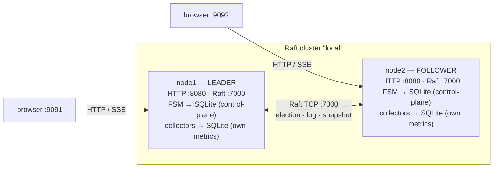
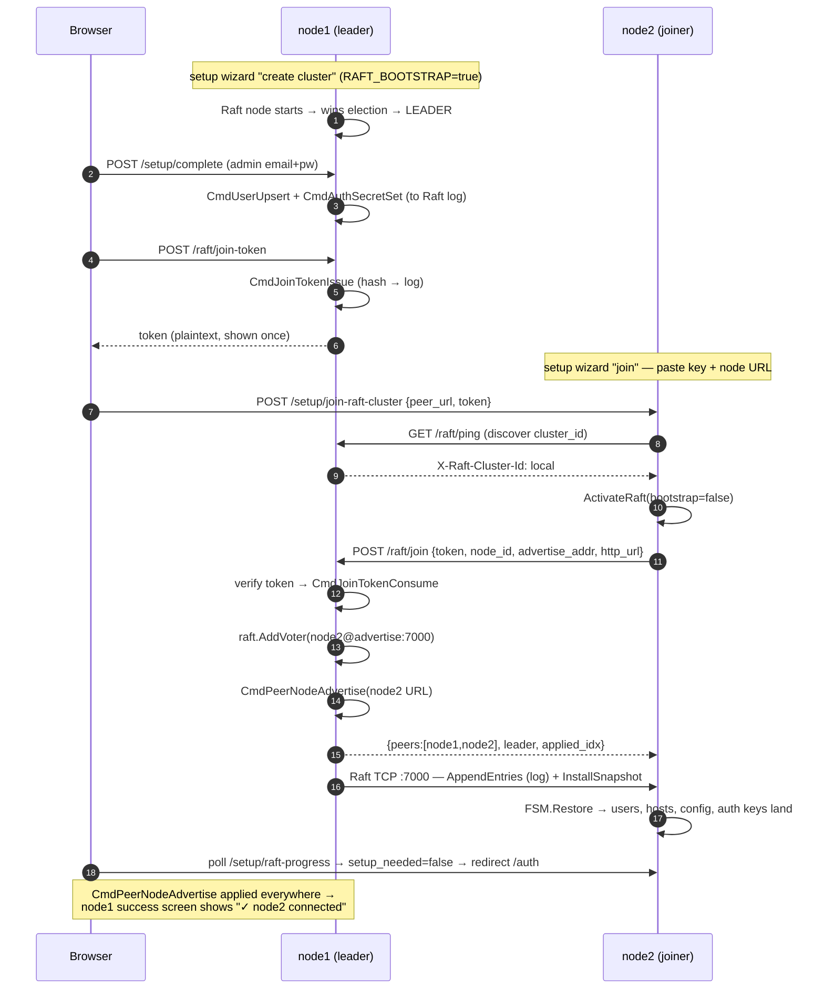
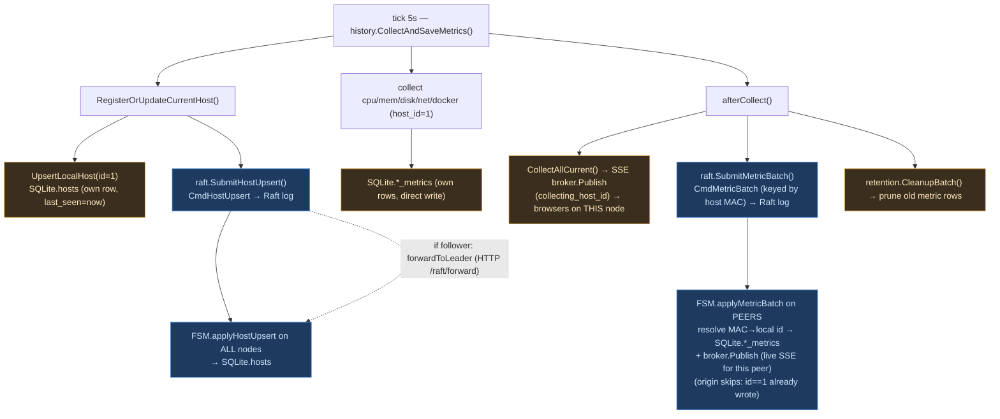
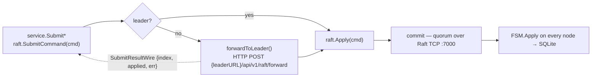

# Cluster architecture (Raft)

How node-stats forms a cluster, what each node talks over which channel, what data flows
at which moment, where it is stored, and how the client sees it.

**One-line model:** Raft replicates the **control-plane** (host registry, users, sessions,
auth keys, config, peer catalog, join tokens) **and the metric time-series** (each node
streams its CPU/mem/disk/net/docker every cycle as a `CmdMetricBatch`). Every node therefore
converges on the same state and can serve any host's stats — and a host's data survives that
host going offline.

> **Failover & quorum.** Reads are always served from each node's local replicated SQLite, so a
> surviving node keeps serving the whole cluster's data. Control-plane **writes** need a Raft
> quorum: with **3+ nodes** losing one keeps quorum (a new leader is auto-elected → full HA);
> with exactly **2 nodes** losing one drops quorum, so the survivor still serves reads but
> can't accept new control-plane writes (or replicate fresh metrics) until the peer returns.
> Each node always keeps collecting and saving its **own** metrics locally regardless of quorum.

---

## 1. Channels & ports

| Channel | Protocol | Who ↔ who | Carries |
|---|---|---|---|
| **Raft transport** `:7000` (`RAFT_BIND_ADDR`) | TCP (hashicorp/raft) | node ↔ node | leader election, `AppendEntries` (log replication), `InstallSnapshot` |
| **HTTP control** `:8080` | REST | joiner → leader | `GET /raft/ping`, `POST /raft/join`, `POST /raft/forward` |
| **HTTP app** `:8080` | REST | browser → node | `/cpu /memory /disk /network /docker`, `/hosts`, `/auth/*`, `/setup/*`, `/raft/status` |
| **SSE** `:8080/stream` | text/event-stream | browser → node | this node's live metric snapshots (`collecting_host_id`) |

In Docker the app port is published as `:9091` (node1) / `:9092` (node2); nodes reach each
other by Compose service name (`node1:7000`, `http://node1:8080`).

---

## 2. Topology



Each node owns its **own** SQLite file. Raft keeps the control-plane part identical across
nodes; the metric tables stay per-node.

---

## 3. Cluster formation (join)



**Stored where:** join token → `cluster_join_tokens` (hash, all nodes); admin → `users`
(all); auth keys → `cluster_config` (all — so a token minted on node1 is valid on node2);
node URL → `peer_node_advertise` (all — needed for write-forwarding).

---

## 4. Steady state — collection cycle (~every 5 s, on every node)



🔵 replicated cluster-wide (via log)  🟠 local to the node. Net effect: the **host registry,
`last_seen` and metric history all converge** — the origin writes its own rows directly and
every peer stores the same batch under its own id for that host (origin skips its own batch to
avoid a double write). Submitting is best-effort: a missing quorum never blocks collection.

---

## 5. Write path through consensus (any control-plane mutation)



Commands that travel this path: `CmdHostUpsert/Delete`, `CmdMetricBatch`, `CmdUserUpsert/Delete`,
`CmdRefreshTokenIssue/Revoke`, `CmdAuthSecretSet`, `CmdConfigSet`,
`CmdPeerNodeAdvertise/Remove`, `CmdJoinTokenIssue/Consume`. (Metric batches are submitted by
every node for its own host; other control-plane writes originate wherever the change happens.)

> The follower→leader forward serialises the result as `SubmitResultWire` (error as a string)
> because `error` is an interface and can't round-trip through JSON.

---

## 6. Storage map

```
  data/raft/  (BoltDB)                       stats.db  (SQLite, per node)
  ────────────────────                       ─────────────────────────────────────────────
  • raft log     (commands)   ◄── consensus   REPLICATED (FSM applier + in snapshot):
  • stable store (term/vote)                    hosts · users · refresh_tokens · cluster_config
  • snapshots    (point-in-time) ──► on join    peer_node_advertise · cluster_join_tokens
                                                cpu_metrics · memory_metrics · disk_metrics
                                                network_metrics · docker_metrics · docker_containers
```

The FSM applies commands into the **same** SQLite the node serves reads from, so every replicated
table — including the metric history — stays in sync across nodes. The origin writes its own
metric rows directly (so collection never depends on Raft being healthy); peers receive the same
rows via `CmdMetricBatch`, keyed by host MAC and stored under each peer's local id for that host.
(`internal/cluster/raft/snapshot_sqlite.go` lists the snapshot-managed tables; a fresh joiner gets
the full history as a baseline, then live batches keep it current.)

---

## 7. How the client sees it

```mermaid
sequenceDiagram
  autonumber
  participant Br as Browser
  participant N as node
  Note over Br: open /machines/:id/stats
  Br->>N: GET /cpu|memory|disk|network|docker?host_id=&hours=  (once)
  N-->>Br: latest + history (from THIS node's local SQLite)
  Br->>N: GET /stream?host_id=  (SSE subscribe)
  loop every collection tick
    Note over N: N publishes its OWN host (afterCollect) AND every replicated<br/>peer's metrics (applyMetricBatch → broker.Publish) to all subscribers
    N-->>Br: snapshot {..., collecting_host_id}
    Note over Br: client keeps events whose collecting_host_id == viewed host;<br/>useLiveMetricsQuerySync merges into React Query → live, no polling
  end
  Note over Br: open /machines — GET /hosts (replicated registry) → all cluster nodes;<br/>GET /health?host_id= → online/offline by last_seen (45s threshold)
```

**Uniform model:** the browser talks only to its own node — one REST load per metric on mount,
then a single SSE subscription for live updates, **for every host the same way**. The node
publishes its own host's metrics each cycle *and* every replicated peer's metrics as their Raft
batches apply, so any host viewed on any node streams live; the client filters by
`collecting_host_id`. Nodes sync among themselves over Raft; the frontend never reaches across to
another node. *(Sensors are Linux-only and not replicated, so remote sensor panels stay empty.)*

---

## 8. What / when / where / how shown

| Data | When | Channel | Stored | Client sees |
|---|---|---|---|---|
| Host registry (`last_seen`, name, MAC) | every 5 s | Raft log `CmdHostUpsert` | `hosts` (all nodes) | `/machines` list, online/offline |
| Metrics CPU/mem/disk/net/docker | every 5 s | local write + Raft log `CmdMetricBatch` | `*_metrics` (all nodes) | charts on any node; **live over SSE for every host** (REST once on mount) |
| Users / roles | on change | Raft log `CmdUserUpsert` | `users` (all) | login works on any node |
| Auth keys (JWT/refresh) | bootstrap / join | Raft log `CmdAuthSecretSet` | `cluster_config` (all) | one token valid on every node |
| Sessions (refresh) | login/logout | Raft log `CmdRefreshToken*` | `refresh_tokens` (all) | seamless refresh on any node |
| Join token | success screen | Raft log `CmdJoinTokenIssue/Consume` | `cluster_join_tokens` (all) | "Connect key" in wizard |
| Node URL | on join | Raft log `CmdPeerNodeAdvertise` | `peer_node_advertise` (all) | write-forwarding + "Nodes connected" |
| Full baseline | join / compaction | Raft snapshot (TCP :7000) | snapshot-managed tables | a fresh node instantly sees admin/hosts/history-at-snapshot |

---

## 9. Key files

| Concern | File |
|---|---|
| Command types | `internal/cluster/raft/commands.go` |
| Producers (Submit*) | `internal/cluster/raft/replicator.go` |
| Appliers (FSM apply) | `internal/cluster/raft/appliers.go` |
| Snapshot / restore (managed tables) | `internal/cluster/raft/snapshot_sqlite.go` |
| Raft node (transport, election, forward) | `internal/cluster/raft/node.go` |
| Join (leader side) / status / token | `internal/cluster/raft/handler.go` |
| Join (joiner side) + progress | `internal/platform/setup/handler.go` |
| Collection loop (~5 s) | `internal/platform/history/service.go` |
| Metric-batch producer (per cycle) | `internal/app/server/server.go` (afterCollect) |
| Metric persist with explicit ts | `internal/metrics/*/repository.go` (`SaveCurrentMetricAt`) |
| SSE broker + stream handler (all hosts) | `internal/app/stream/broker.go`, `internal/platform/stream/handler.go` |
| Frontend metric fetch (REST + SSE) | `frontend/src/shared/hooks/useMetricQuery.ts`, `useEventSource.ts`, `useLiveMetricsQuerySync.ts` |
| Setup wizard (create / join / success) | `frontend/src/widgets/setup/` |
| Cluster admin panel | `frontend/src/widgets/raft/RaftClusterWidget.tsx` |
| Local 2-node test harness | `scripts/localcluster.sh`, `docker-compose.cluster.yml` |
