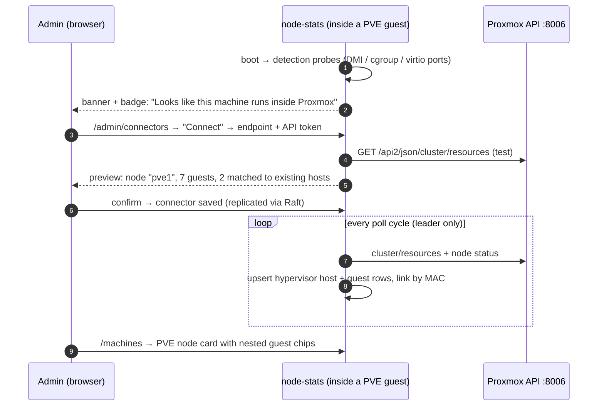

# Proxmox connector — design

Use case: node-stats is installed on a VM or LXC **inside** a Proxmox node. We want to
(a) detect that, (b) offer the admin a one-click way to connect the Proxmox API, and
(c) once connected, show the **Proxmox node as the top-level machine card** with full
details, with all of its guests (VMs/LXCs) rendered **minimized inside** that card and
inside the node's detail page — **without duplicating** machines in the DB or the UI
when one or several of those guests already run node-stats themselves.

Status: **implemented** (phases 1–2 and most of 3; deltas from this design are
listed at the end of the document).

**One-line model:** a *connector* is a configured external data source (first one:
Proxmox VE API). It discovers the hypervisor and its guest topology, links guests to
already-registered hosts **by MAC address** (the identity key the cluster already uses),
creates connector-sourced host rows for guests that have no agent, and feeds
hypervisor-level metrics through the **existing** Raft commands (`CmdHostUpsert`,
`CmdHostLastSeen`, `CmdMetricBatch`) so every node in a cluster sees the same tree.

---

## 1. The user journey



1. **Detect.** On every host-info collection cycle the node runs cheap, local,
   credential-free probes. If they say "we are a QEMU/KVM VM or an LXC container", a
   *discovered connector hint* appears in `GET /connectors` (admin-only).
2. **Notify.** The frontend shows a one-time toast + a persistent badge on the settings
   icon: *"Detected that this machine runs inside Proxmox — connect it for full stats."*
   Clicking opens the new **Connectors** admin tab.
3. **Connect.** The admin enters the API endpoint (pre-filled with the detected gateway,
   e.g. `https://192.168.1.2:8006`) and an API token. We test the credentials
   (`POST /connectors/proxmox/test`), show a preview of what was found (node name, guest
   count, how many guests matched existing hosts), then persist.
4. **Browse.** The machine list now shows the **Proxmox node** as a first-class card
   (CPU/mem/disk of the hypervisor itself, from the PVE API). Guests are nested chips
   inside the card. Guests that run node-stats keep their full detail pages; guests
   without an agent get the limited stats Proxmox provides. Nothing appears twice.

---

## 2. Detection (no credentials required)

Lives next to the other environment probes (`internal/platform/setup/machine_hints.go`
is the precedent; detection itself goes into the new connector package, see §4). All
probes must honour `HOST_PROC`/`HOST_SYS`/`HOST_ROOT` so they work from inside the
Docker deployment.

| Probe | Signal | Meaning |
|---|---|---|
| gopsutil `host.Info()` | `VirtualizationSystem=kvm`, `Role=guest` | generic KVM guest — already collected and stored on the host row today |
| `${HOST_SYS}/class/dmi/id/sys_vendor` == `QEMU` | QEMU/KVM VM | strong hint; Proxmox VMs report vendor `QEMU`, product `Standard PC (i440FX/Q35 …)` |
| `${HOST_SYS}/class/dmi/id/product_uuid` | SMBIOS UUID | equals the guest's `smbios1` UUID in its PVE config → exact identity match once the API is connected |
| `/dev/virtio-ports/org.qemu.guest_agent.0` exists | QEMU guest-agent channel | typical for PVE VMs with the agent enabled |
| `${HOST_PROC}/1/environ` contains `container=lxc` | LXC container | generic LXC |
| `${HOST_PROC}/self/cgroup` matches `/lxc/<vmid>` | **Proxmox** LXC | PVE puts containers into an `lxc/<vmid>` cgroup → we even learn our own **VMID** for free |
| default gateway IP (`${HOST_PROC}/net/route`) | candidate endpoint | pre-fills the connector form with `https://<gw>:8006` |

None of these is individually conclusive for *Proxmox* (vs. plain libvirt/KVM), so the
result is a **hint with a confidence level and evidence list**, not a fact:

```json
GET /connectors
{
  "discovered": [{
    "type": "proxmox",
    "confidence": "high",            // high = lxc/<vmid> cgroup or guest-agent port; medium = bare QEMU DMI
    "guest_kind": "lxc",             // vm | lxc
    "vmid_hint": 105,                // when extractable
    "suggested_endpoint": "https://192.168.1.2:8006",
    "evidence": ["cgroup:/lxc/105", "container=lxc"]
  }],
  "configured": []
}
```

The hint is computed lazily and cached; it never blocks startup and never fails hard
(same best-effort contract as `DetectMachineHints`). A dismissed hint is remembered
(config-store key via the existing `CmdConfigSet`), so the banner doesn't nag forever —
the Connectors tab still lists it.

---

## 3. Proxmox API surface we consume

Auth: **API token** (`Authorization: PVEAPIToken=user@realm!tokenid=secret`) — no
sessions/CSRF needed, revocable, and can be scoped read-only. Recommended setup for the
user (shown in the connect form): role **PVEAuditor** on `/` (Sys.Audit + VM.Audit +
Datastore.Audit). PVE ships a self-signed cert by default → the form needs a
*skip TLS verify* toggle (default on for private endpoints, with a warning) and an
optional CA upload later.

| Endpoint | Used for | Cadence |
|---|---|---|
| `GET /cluster/resources?type=vm` + `type=node` | the whole topology + live cpu/mem/disk/netin/netout/status/uptime per guest and per node, **one cheap call** | every poll (~10 s) |
| `GET /cluster/status` | PVE cluster name + node fingerprints → **connector fingerprint** for dedup (§7) | on connect + hourly |
| `GET /nodes/{node}/status` | hypervisor details: CPU model, cores, memory total, PVE version, load | every poll |
| `GET /nodes/{node}/network` | node NIC MACs → identity of the hypervisor host row | topology resync (5 min) |
| `GET /nodes/{node}/qemu/{vmid}/config`, `…/lxc/{vmid}/config` | guest NIC **MACs** (`net0: virtio=AA:BB:…`), `ostype`, `smbios1` UUID, name | topology resync (5 min) |
| `GET /nodes/{node}/{qemu\|lxc}/{vmid}/rrddata?timeframe=hour` | history backfill for agent-less guests | on first sight of a guest |

`/cluster/resources` works identically on single-node PVE and PVE clusters (it then
returns several `type=node` rows → we create one hypervisor host per PVE node).

---

## 4. Backend: connector module

New package `internal/platform/connectors/` (framework + registry: entity, repository,
service, handler, detection hints) and `internal/metrics/proxmox/` (the PVE client +
poller, mirroring how `internal/metrics/docker` owns the Docker integration). Wired in
`internal/app/di/container.go`, routes in `internal/app/server/server.go`, migration in
`internal/app/database/migrations.go` — the usual hard rules.

### Entity

```go
type Connector struct {
    ID          uint   `gorm:"primaryKey"`
    Type        string // "proxmox"
    Endpoint    string // https://192.168.1.2:8006
    TokenID     string // user@realm!tokenid
    SecretEnc   []byte // AES-GCM, key derived from JWT_SECRET (HKDF)
    SkipVerify  bool
    Fingerprint string `gorm:"uniqueIndex"` // PVE cluster name + node IDs (§7)
    Status      string // ok | auth_failed | unreachable | disabled
    LastSyncAt  time.Time
    LastError   string
}
```

The token secret is encrypted at rest with a key derived from the already-mandatory
`JWT_SECRET`, because connector rows are **replicated via Raft** (new
`CmdConnectorUpsert`/`CmdConnectorDelete` commands, registered the standard way in
`internal/cluster/raft/{commands,payloads,appliers,replicator}.go`) so that any node
can take over polling after a failover. Plaintext secrets in the Raft log/snapshots are
not acceptable; ciphertext is fine since every node shares `JWT_SECRET`.

### Routes (all admin, `RequireAdmin()`)

```
GET    /connectors                  # { discovered: [hint], configured: [connector] } — secrets never echoed
POST   /connectors/proxmox/test     # validate endpoint+token, return preview (node, guests, match count)
POST   /connectors                  # create (runs test first)
PATCH  /connectors/:id              # enable/disable, rotate token
DELETE /connectors/:id              # remove connector + optionally its connector-only host rows
POST   /connectors/:id/sync         # force topology resync
```

### Poller & cluster coordination

Exactly **one node polls a given connector**: the **Raft leader** (standalone node =
trivially the leader of itself). The poller is a small loop like the history-metrics
collector: on leadership gain start, on leadership loss stop. Everything it learns is
submitted through Raft, so followers converge:

- hypervisor + guest host rows → `CmdHostUpsert`
- guest/node liveness → `CmdHostLastSeen`
- hypervisor (and agent-less guest) metrics → `CmdMetricBatch` (existing payload,
  `HostMAC` keyed — no new metric command needed)

If the leader cannot reach the PVE endpoint (e.g. only one guest VM has network access
to the hypervisor), the connector row records `unreachable` + which node last succeeded;
v1 keeps it simple (leader polls or nobody), a later iteration can add an
`owner_node_id` preference with forwarding.

---

## 5. Host topology: data model

`internal/cluster/hosts.Host` gains four columns (one migration):

```go
HostType   string  // "" (unknown) | bare-metal | hypervisor | vm | lxc
ParentMAC  string  `gorm:"index"` // MAC of the hypervisor host row; "" = top-level
Source     string  // agent | connector | agent+connector
ExternalID string  // "pve:<fingerprint>/<node>/qemu/<vmid>" — stable connector-side id
```

`ParentMAC` (not a local row id) because Raft identity is MAC-based: local autoincrement
ids differ per node, MACs don't. `GET /hosts` resolves `parent_id` per-node at read time
and the existing `HostSchema` on the frontend grows the same optional fields. The
hypervisor row's own MAC comes from `/nodes/{node}/network` (first physical NIC).

The PVE **node** is a normal host row (`HostType=hypervisor`, `Source=connector`), so
the whole existing pipeline — health, metric storage, SSE, Raft replication, machine
card — works for it unchanged.

---

## 6. Deduplication: linking guests to existing hosts

The hard requirement: a guest that already runs node-stats must **not** appear twice.
Matching runs during topology resync, in priority order:

1. **MAC address** (primary). The guest's PVE config lists its NIC MACs; the agent
   registered the same MAC (`hosts.mac_address`, unique index). Exact match → *link*:
   set `HostType`, `ParentMAC`, `ExternalID`, `Source=agent+connector` on the existing
   row. No new row.
2. **SMBIOS UUID** (secondary, VMs only). PVE `smbios1` UUID vs the guest's
   `product_uuid`. Today gopsutil's `HostID` is `/etc/machine-id` on Linux, so the host
   row additionally collects `product_uuid` into a new `HardwareUUID` field during
   registration. Covers MAC-spoofing/bridge edge cases.
3. **No match** → create a connector-sourced row (`Source=connector`) keyed by the
   guest's first MAC from config (or a synthetic `pve:<…>/<vmid>` pseudo-MAC if the
   guest has no NIC).

Self-linking falls out automatically: the node that runs the poller finds **its own**
MAC among the guest configs and becomes a child of the hypervisor — which is precisely
the original use case.

Precedence rules when a host is `agent+connector`:

- **Metrics:** agent wins, always. The poller skips `CmdMetricBatch` for any guest
  whose row has a fresh agent heartbeat (`LastSeen` within `HostOfflineThreshold` and
  `Source` includes `agent`). If the agent goes silent, the connector keeps the row
  *visible* (PVE-level cpu/mem + status) instead of letting it go dark.
- **Liveness:** `status=online` keeps meaning "agent heartbeat fresh". Connector-only
  rows get a third state instead of faking it: `running | stopped` from PVE
  (`HealthResponse.Status` gains those values; the card shows amber "running (no
  agent)" rather than green "online").
- **Deletes:** removing a connector deletes only rows with `Source=connector`;
  linked rows are just unlinked (fields cleared).

Known caveat (documented in the connect form): an agent deployed in Docker **without
host networking** may register a veth MAC that matches nothing in the PVE config. The
preview step surfaces unmatched guests so the admin sees it immediately; fallback
matching by UUID (VMs) covers most of these.

---

## 7. Connector dedup across instances

Connector identity = **fingerprint** from `/cluster/status`: the PVE cluster name
(`cluster/<name>`), or for a standalone node the node name **qualified by the
endpoint host** (`node/<name>@<host:port>`) — every default install is named
"pve", and several independent Proxmoxes must coexist as separate connectors
(the Connectors tab is a plain list; "Add Proxmox connector" is always
available). Re-connecting the *same* fingerprint updates credentials in place.
Unique index on the column.

- **Several node-stats guests in one Raft cluster:** the connector row replicates;
  configuring it once is enough; the hint disappears everywhere (`configured` match by
  fingerprint suppresses the `discovered` entry). Leader polls — no double polling, no
  duplicate rows.
- **Several standalone node-stats instances on the same PVE:** each has its own DB and
  its own UI, so there is nothing to deduplicate *between* them — each one may connect
  the same Proxmox and each shows the full tree. If they later **join** into one Raft
  cluster, the joiner is caught up from the leader's snapshot and its local connector
  config is discarded in favour of the replicated one (same-fingerprint rule); its
  connector-sourced host rows merge by MAC exactly like agent rows do today.

---

## 8. Frontend

### Machine list (`MachineListPage`)

`useHosts()` already returns the flat list; with `parent_id`/`host_type` it groups
client-side:

```
┌─ pve1 ─ Proxmox VE 8.2 ─────────────── [proxmox icon] ─┐
│  cpu ▓▓▓░ 34%   mem ▓▓▓▓▓░ 61%   disk …   (node stats) │
│  ───────────────────────────────────────────────────── │
│  guests:                                                │
│   ⊞ media-vm   [ubuntu]  ● online   cpu 12%  mem 48%   │  ← has agent → links to /machines/:id/stats
│   ⊞ ha-lxc     [debian]  ◐ running  cpu  2%  mem 21%   │  ← connector-only, amber state
│   ⊞ win-games  [windows] ○ stopped                     │
└─────────────────────────────────────────────────────────┘
```

- The hypervisor card keeps the existing `HostCard` body (sparklines fed by the
  connector's `CmdMetricBatch` rows — same query path) and gains a **guests** section
  of compact rows: OS icon, name, state dot, cpu/mem mini-values.
- Hosts with a `parent_id` are **removed from the top-level grid** — that's the no-UI-
  duplication rule. Clicking a guest with an agent goes to its normal stats page;
  a connector-only guest opens a slim detail (PVE-level charts only, with an inline
  hint "install node-stats on this machine for full stats").

### Detail page (`MachineStatsPage`)

For `HostType=hypervisor` the standard widget grid is appended with a **"Virtual
machines"** widget — same minimized rows as the card, plus per-guest disk and net I/O
from `/cluster/resources`. The breadcrumb (`MachineWorkspaceBar`) shows
`pve1 ▸ media-vm` for child hosts, so a guest's page exposes its parent.

### Connectors tab

New admin route `/admin/connectors` as a third tab in `AdminNav` (Users | Nodes |
**Connectors**). Contents:

- *Discovered* section: the hint card — evidence list, confidence, "Connect" CTA, "Dismiss".
- Connect form: endpoint (pre-filled), token id, token secret, skip-TLS-verify toggle;
  on submit → `/connectors/proxmox/test` → preview ("node pve1, 7 guests, 2 matched") → save.
- *Configured* section: connector row with status (`ok`/`unreachable`/`auth_failed`),
  last sync time, sync-now / disable / delete actions. Errors via `sonner` toasts,
  consistent with `NodesTab`.

Notification: while an undismissed hint exists and no connector matches it, admins get
one `toast.info` per session plus a dot badge on the header settings icon.

### OS icons

Applies independently of Proxmox (Phase 1, see §9): machine cards currently render
plain text `platform`/`os`. Add `shared/icons/os/` with a small bundled SVG set —
**proxmox**, debian, ubuntu, alpine, fedora, centos/rhel, arch, nixos, windows, macOS
(apple), freebsd, generic linux (tux), generic server — and one mapper:

```ts
// shared/lib/osIcon.ts
osIcon({ host_type, platform, platform_family, os, pve_ostype }) → ReactNode
// hypervisor → proxmox; platform "ubuntu" → ubuntu; family "rhel" → fedora-ish;
// pve ostype l26/l24 → linux, win10/win11 → windows; fallback by `os` (linux/windows/darwin); else Server icon
```

lucide-react has no brand icons, and pulling all of `simple-icons` is overkill — a
dozen local SVGs (`currentColor`, licensed from simple-icons' set) keep the bundle
flat. The icon shows on: machine card header (before the name), nested guest rows,
the workspace-bar breadcrumb, and the admin Nodes tab. For connector-only guests the
PVE `ostype` field drives the mapping (stored on the host row's `Platform` as e.g.
`win11`, with `PlatformFamily=windows`).

---

## 9. Phasing

| Phase | Scope | Value |
|---|---|---|
| **1. Icons + detection** | OS icon set + mapper (existing `platform` fields suffice); detection probes; `GET /connectors` with `discovered` only; Connectors tab showing the hint with a "coming soon" connect form; settings-icon badge + toast | immediate UI win; validates detection in the wild before any API work |
| **2. Connector core** | PVE client, test/create/delete routes, encrypted secret storage, `CmdConnectorUpsert/Delete`, topology resync, host columns + migration, MAC/UUID linking, hypervisor + guest rows, nested cards & guests widget | the headline use case works end-to-end |
| **3. Metrics & polish** | leader-side poll loop feeding `CmdMetricBatch` for the node + agent-less guests, `rrddata` backfill, `running/stopped` health states, slim detail page for connector-only guests, connector status surfacing | full stats parity & day-2 operations |

---

## 10. Implementation deltas

Decisions made while implementing (where the code deviates from or refines the
sections above):

- **No `CmdHostTopologySet`** — `CmdHostTopologySet`/`TopologyLink` collapsed
  into `CmdConnectorHostUpsert`: `UpsertConnectorHost` detects an
  agent-maintained row by source and then applies a column-limited topology
  update only, which is the same semantics with one less command type. Agent
  rows are only re-submitted when topology/power-state actually changed.
- **Secrets replicate by decision** — every node is a full clone able to take
  over (per review); the token secret is AES-GCM ciphertext under a key
  derived from the cluster-shared `JWT_SECRET` in the Raft log/snapshots.
- **Connector runtime status is local** — `status`/`last_sync_at`/`last_error`
  are written directly by the polling node and not replicated (cosmetic;
  followers may show the last value from their own leadership term).
- **No third health state on `/health`** — liveness stays last_seen-based.
  The poller refreshes `last_seen` for *running* connector-owned rows only,
  and the UI derives the amber "running (no agent)" / grey "stopped" states
  from `source` + `guest_status` client-side.
- **Hint dismissal is client-side** (localStorage + once-per-session toast),
  not a replicated config key; the Connectors tab always lists hints.
- **No UUID matching yet** — linking is MAC-only (gopsutil's `HostID` is
  machine-id, not the SMBIOS UUID, so matching `smbios1` needs collecting
  `product_uuid` separately). The poller does prefer an agent row over a
  previously-created connector row when both match, and deletes the stale
  connector duplicate.
- **No rrddata backfill** — connector-only guests accumulate history from
  connect time onward; guest disk usage is written only when PVE reports it
  (QEMU without guest agent reports 0).
- **Guest chips get live cpu/ram from the SSE stream, not REST** — the stream
  already broadcasts every host's snapshot (`collecting_host_id` envelopes),
  so one subscription per page feeds a per-host gauges store
  (`hostGaugesStore`) that the minimized rows read from; zero extra requests.
  Values older than 30 s are hidden. Full chart history stays on the guest's
  stats page.
- **Metrics for an `agent+connector` host never fall back to the connector**
  when the agent goes silent — the row stays visible with PVE power state,
  but history pauses until the agent returns (avoids mixing two writers under
  one host id).

## 11. Open questions

1. **Secret replication trade-off** — AES-GCM-under-`JWT_SECRET` in the Raft log is the
   proposal; the alternative (secret stays on the configuring node, `.env.agent`-style)
   breaks poller failover. Confirm the threat model accepts ciphertext in snapshots.
2. **Guest actions** — start/stop/reboot via the PVE API is tempting but changes the
   token scope from read-only (PVEAuditor) to `VM.PowerMgmt`. Out of scope for v1;
   the UI should not foreclose it (guest rows get an action menu later).
3. **Other hypervisors** — the connector framework (hints, registry, parent/child
   hosts) is generic; ESXi/libvirt/Docker-host could be later connector types. Only the
   `type` field and the per-type client/prober are Proxmox-specific. Naming stays
   generic everywhere except `internal/metrics/proxmox`.
4. **PVE clusters spanning many nodes** — `/cluster/resources` gives every node and
   guest at once; we create one hypervisor row per PVE node and parent each guest to
   the node it currently runs on. Live-migration just flips `ParentMAC` on the next
   resync. Acceptable to show a migrated guest under the old node for ≤5 min?
